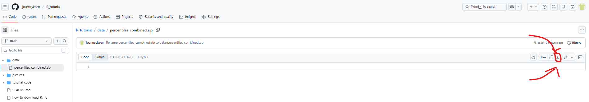

# README for the IDDA BEE Program (READ BEFORE CLICKING ELSEWHERE)

This file describes the structure of the project. It is the first thing you should read.

## Folders

- `/data/` contains data you will download as part of the R tutorial.
- `/code/` contains some sample code for you to see.
- `/tutorial_code/` contains the code used to create the tutorial. Don't look here if you are a BEE.

You should create your own folder for this program (maybe `/BEE/`) with a subfolder `/data/` for which you will store some data we give you. Another subfolder `/code/` would not hurt, either.

Note that in the future, when I say "directory" that means the entire file path that leads to a folder. These typically look something like `C:/Users/person/Desktop/folder_1/folder_2/data_folder/`. Here, the entire thing is the directory, but we might refer to the last folder in it, `/data_folder/`, as the folder. I recomment you put something like `C:/Users/person/Desktop/BEE/data/` as your BEE folder, and then make a `/data/` subfolder inside it.

### How to download data and codes.
Click the folder you are downloading from, for example `/data/`. Then click on the file you are downloading, for example `percentiles_combinded.zip`. At the top right of the screen will be the download icon, as is shown:

Save it in your own personal `/data/` subfolder in your BEE folder. This file is "zipped", so you need to unzip it before using. Right-click it the file after saving and then select `Extract All...` or something like that. Put the extracted version in the same folder.

## Files

- `how_to_download_R` shows you how to download R on Windows or Mac. This is the first thing to do.
- `R_tutorial` is what you will read next. It shows what R looks like and explains the basics of R. This is what you should download and open in your browser after downloading R and RStudio in the last dash.
