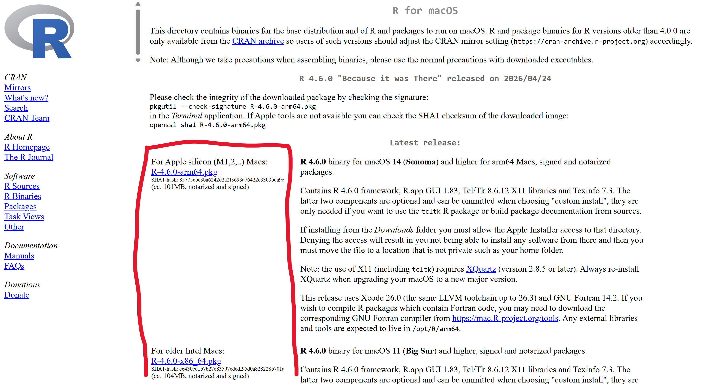
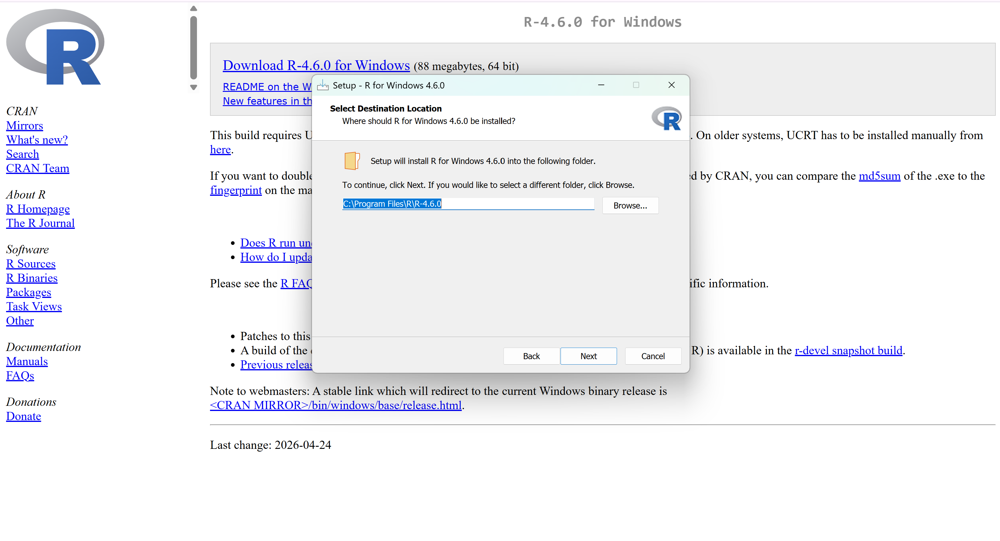
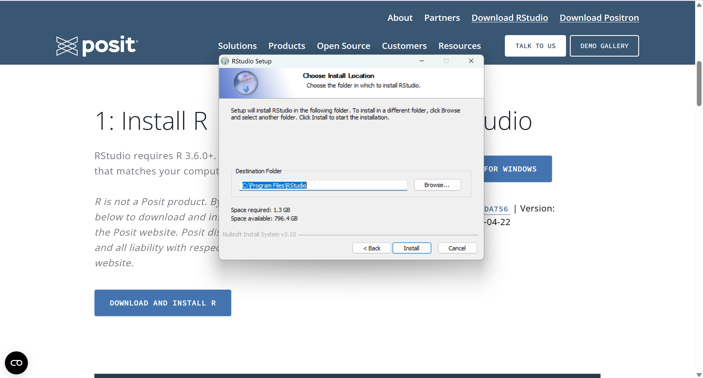

# R_tutorial
Written for Fed MPLS BEE Program. Below is a quick tutorial on how to download R.

# Download R and RStudio
Follow the instructions in order. I provided some screenshots. If there is not a screenshot for something, then stick to default settings. The first file you download for both R and RStudio is an "executible" and can be in any folder. After you finish the downloads you can delete them. For the folders for actually holding R and RStudio you will want to use the default path the downloads give you, your program files.

## Download R link:
[Download R Site](https://mirror.its.umich.edu/cran/)

Here is what the link looks like. Choose the appropriate link for your computer.

# Windows people:
Choose "base" and then click "Download R-4.6.0 for Windows." This second click will download the executable, which can be in any folder.

# Mac people:
You will need to click based upon your computer. Here is where you need to look:

------------ Fill-in here ---------------

# Lixux people:
------------ Fill-in here ---------------

# When downloading:
You will get to a screenshot like this after you choose some default options after clicking "Next" a few times:

## Download RStudio link:
[Download RStudio Site](https://posit.co/download/rstudio-desktop)

Go to this website and click the link on the right, 2. You will get an executible that after downloading will eventually get you a screen like this. Stick with the default options. 

After this search RStudio on your computer and open it. The "R_Tutorial" will guide you from there.
